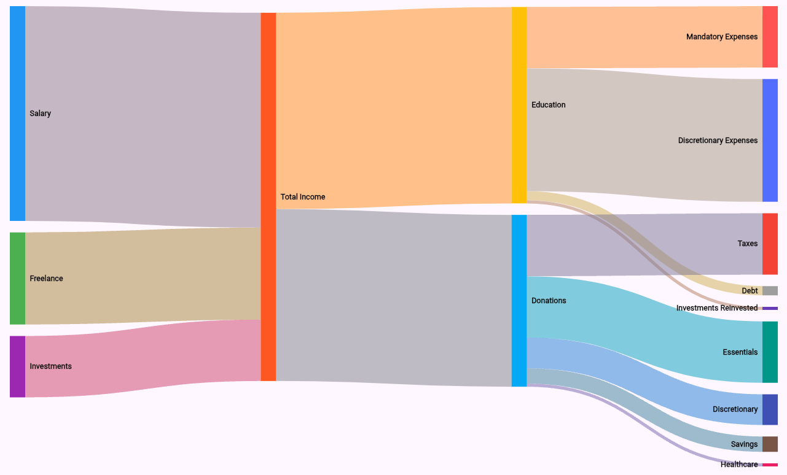

# Sankey Flutter

**Version:** 0.0.2

Sankey Flutter is a Flutter package for rendering beautiful and interactive Sankey diagrams. This package adapts the proven [d3-sankey](https://github.com/d3/d3-sankey) layout algorithm into Dart, so you can generate complex node-link diagrams with customizability and high performance directly in your Flutter apps.

## Features

- **Dynamic Layout:** Automatically compute node and link positions.
- **Customizable Appearance:** Adjust node width, padding, alignment options, and theming.
- **Smooth Curved Links:** Render links using cubic Bézier curves similar to d3's horizontal link shape.
- **Interactivity:** Easily extendible for adding tap, hover, or animation effects.
- **Open Source:** Fully available for modification and extension.



## Installation

Add the following dependency to your `pubspec.yaml` file:

```yaml
dependencies:
  sankey_flutter: ^0.0.1
```

Then, run:

```bash
flutter pub get
```

## Usage
See the example for a full working sample. Here’s a quick snippet to render a basic Sankey diagram:

```bash
import 'package:flutter/material.dart';
import 'package:sankey_flutter/sankey.dart';
import 'package:sankey_flutter/sankey_node.dart';
import 'package:sankey_flutter/sankey_link.dart';
import 'package:sankey_flutter/sankey_painter.dart';

void main() {
  runApp(MaterialApp(
    home: Scaffold(
      appBar: AppBar(title: Text('Sankey Diagram Example')),
      body: Center(
        child: CustomPaint(
          size: Size(400, 400),
          painter: SankeyPainter(
            nodes: nodes, // List of [SankeyNode] objects.
            links: links, // List of [SankeyLink] objects.
          ),
        ),
      ),
    ),
  ));
}
```

For a complete working example with interactivity and layout computation, please refer to `example/main.dart`.

## Documentation
For detailed API documentation, please review the inline comments in the source code and visit the package page on pub.dev.

## Contributing
Contributions are welcome!! Your contributions help improve the package and benefit the entire Flutter community. The package strives to closely mirror the output of d3-sankey to ensure familiarity and reliability.

Thank you for contributing to Sankey Flutter!

## License
This project is licensed under the `BSD-3-Clause` License.
